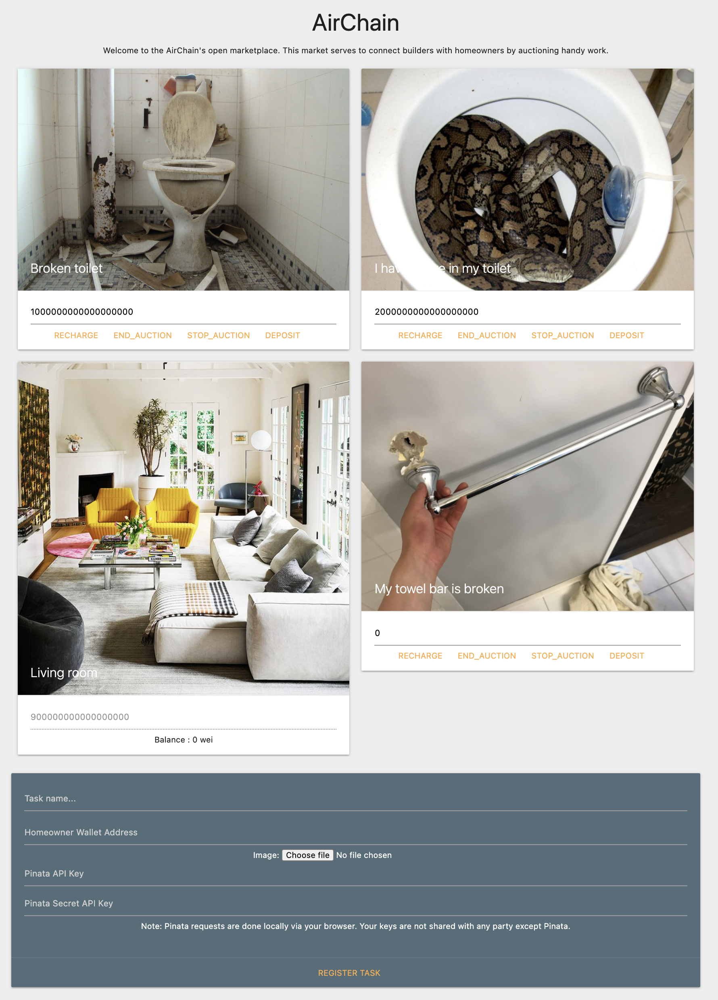

# Airtasker on Chain - homeowner seeking handy work
Airtasker on Chain is a dApp that connects homeowners with builders together by auctioning handy tasks. Homeowners can post handy tasks on the dApp, then builders can bid for the lowest price that they are willing to do the task for. Homeowners pay builders by Etherium, and builders bid by Air Token, which is a token made specifically for our bidding system.

## How to Run the dApp
Ropster Test Network:
1. Switch to Ropster Test Network on MetaMask
2. Click [here](frontend/index.html) to launch the application.

Local:  
1. Launch your local Etherium blockchain network on Ganache
2. Switch to Localhost on MetaMask
3. Deploy the `TaskMarket.sol` contract on Remix and copy it address
4. Replace the contract address in line 2 in `dapp.js` by the deployed `TaskMarket.sol` contract address
5. Open Terminal/Git Bash and `cd` into the `frontend` folder of this dApp
6. Run the following command `python -m http.server 8000`
7. Open your browser and visit http://0.0.0.0:8000

## User Interface

## User Journey Diagram

## Technology Stack
Solidity, Pinnata, Remix, Ganache, MetaMask, HTML, Javascript

## Explanation of Each File and Folder
`frontend`: a folder containing all front end files  
`index.html`: make up the dApp's user interface  
`dapp.js`: the connection between front end and back end
`TaskMarket.json`: Store the ABI of the `TaskMarket.sol` contract
`TaskAuction.json`: Store the ABI of the `TaskAuction.sol` contract

`image`: a folder containing all image files used in `README.md`
`ui.png`: screenshot of the dApp's user interface

## Contributors
Fil (@filprager)  
- Email:  
- LinkedIn:   
- Twitter:
- Tasks:    

Mark (@marksenyang)
- Email: marksenyang@gmail.com
- LinkedIn: https://www.linkedin.com/in/marksenyang/
- Twitter: https://twitter.com/MarkSenYangAu
- Tasks: 

Paul (@emo-hs)
- Email: 
- LinkedIn: 
- Twitter: 
- Tasks: 

Sammuel (@risksam)
- Email: 
- LinkedIn: 
- Twitter: 
- Tasks: 

