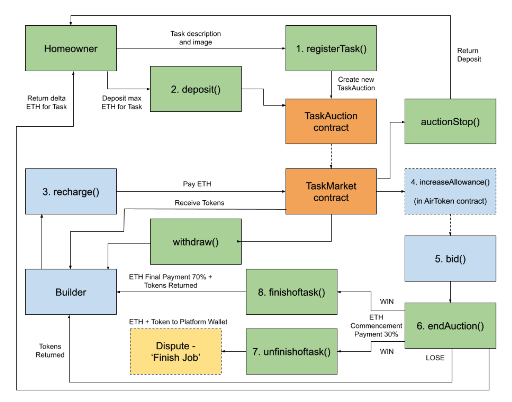

# AirChain DApp - AirTasker on Blockchain

AirChain is a DApp that connects homeowners with builders by auctioning tasks. Homeowners post details of their desired task on the DApp, then builders can bid their offer price to perform the task. The lowest price from the builder wins the auction (more conditions can be added in future). Homeowners pay builders with Ether, and builders bid with AirTokens, which are tokens made specifically for our bidding system.

## How to Run the DApp
Ropsten Test Network:
1. Switch to Ropsten Test Network on MetaMask
2. Click [here](https://marksenyang.github.io/AirChain/frontend/index.html) to launch the application.

Local:  
1. Set up your local Ethereum blockchain network on Ganache and make sure to increase the **gas limit**
2. Switch to Localhost on MetaMask
3. Tick the **Enable optimization** checkbox  
4. Deploy the `TaskMarket.sol` contract on Remix and copy its address
5. Replace the contract address in line 2 in `dapp.js` by the deployed `TaskMarket.sol` contract address
6. Open Terminal/Git Bash and `cd` into the `frontend` folder of this DApp
7. Run the following command `python -m http.server 8000`
8. Open your browser and visit http://0.0.0.0:8000

## User Interface

## Logical Diagram

## Contract Hierarchy

## Physical Diagram

## Technology Stack
Solidity, Pinnata, Remix, Ganache, MetaMask, HTML5, Javascript, IPFS

## Explanation of Each File and Folder
`frontend`: a folder containing all front end files  
`index.html`: make up the dApp's user interface  
`dapp.js`: the connection between front end and back end  
`TaskMarket.json`: Store the ABI of the `TaskMarket.sol` contract  
`TaskAuction.json`: Store the ABI of the `TaskAuction.sol` contract

`image`: a folder containing all image files used in `README.md`

`presentation`: a folder containing presentation slides

`AirTokenMintable.sol`: Contract for Air Token  
`AirTokenSale.sol`: Contract for sales of Air Token   
`TaskAuction.sol`: Contract for the each individual task auction  
`TaskMarket.sol`: Contract where users interact with all task auctions

## Contributors
Fil (@filprager)  
- LinkedIn: http://linkedin.com/in/filprager

Mark (@marksenyang)
- LinkedIn: https://www.linkedin.com/in/marksenyang/

Paul (@emo-hs)
- LinkedIn: http://linkedin.com/in/paul-han-885b15a0

Samuel (@risksam)
- LinkedIn: https://www.linkedin.com/in/samuel-wytenburg/

